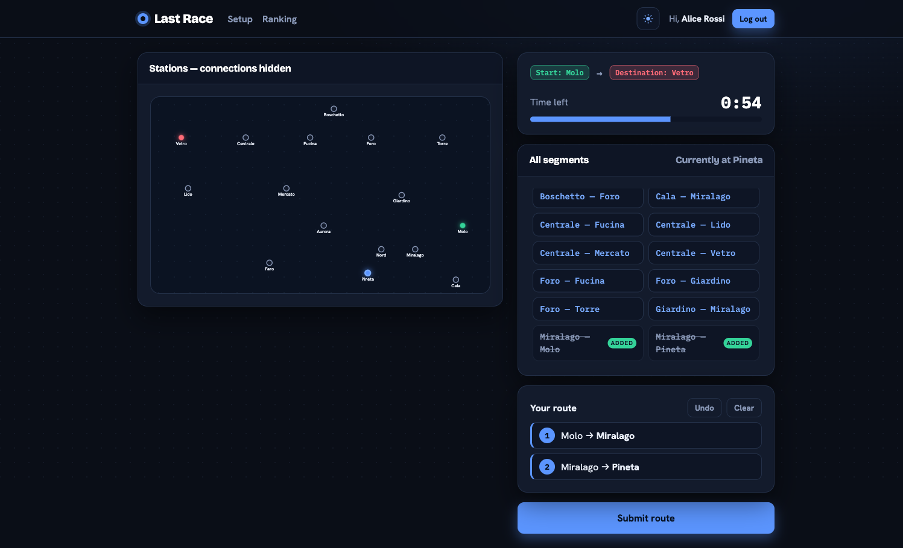
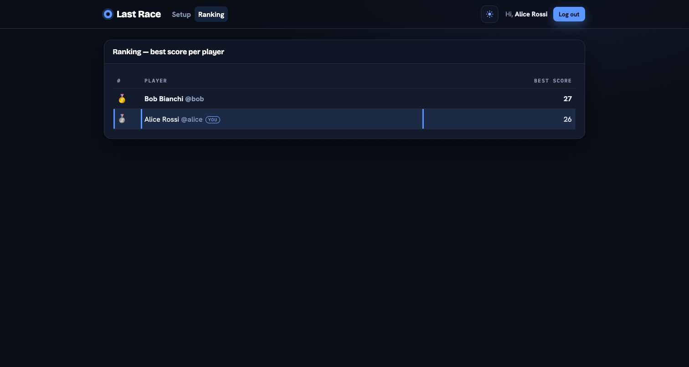

# Last Race

Last Race is a full-stack web application built with **React, Node.js/Express, and SQLite**.

The application is an interactive route-planning game where authenticated users navigate a transport network, build routes under a time limit, experience random events during the journey, and compete through a ranking system.

## Features

- User authentication with session-based login
- Interactive transport network
- Timed route planning
- Route validation and game simulation
- Random events affecting the player's score
- Game result tracking
- Ranking based on each user's best score
- Protected routes for authenticated users
- Light and dark themes
- Persistent data storage with SQLite

## Tech Stack

### Frontend

- React 19
- Vite
- JavaScript
- React Router
- React Bootstrap
- React Context API

### Backend

- Node.js
- Express.js
- SQLite
- Passport.js
- REST APIs
- Session-based authentication

## Screenshots

### During a Game

Planning phase with the edge-less map and the full list of available segments.



### Ranking

Best score per registered player.



## Architecture

The project follows a separated client-server architecture:

- React frontend implemented as a single-page application
- Express backend exposing REST APIs
- SQLite database for persistent application data
- Passport.js authentication using sessions and cookies
- Dedicated API layer on the client
- Database access handled on the server
- Client-side routing with React Router
- Application-wide authentication and theme state using React Context

## Application Flow

A logged-in user can start a new game from the network overview.

The server assigns a starting station and destination at least three stops apart. During the planning phase, the player has **90 seconds** to construct a route by selecting segments in sequence.

The submitted route is validated by the server and then simulated.

During execution, each hop may trigger a random event that changes the player's score.

The final score is stored in the database and can contribute to the ranking.

---

# Server-side

## HTTP APIs

| Method & path | Auth | Request | Response |
|---------------|:----:|---------|----------|
| `POST /api/sessions` | — | `{username, password}` | `200 {id, username, name}` · `401` on bad credentials |
| `GET /api/sessions/current` | — | — | `200 {id, username, name}` if logged in · `200 null` if anonymous (session-state probe) |
| `DELETE /api/sessions/current` | session | — | `204` logout |
| `GET /api/network` | session | — | `{stations[], lines[], segments[], interchanges[]}` — full map including lines, used by Setup |
| `POST /api/games` | session | — | `201 {id, start, destination, stations[], segments[]}` — start/destination assigned at least 3 stops apart; segments contain no line information during Planning |
| `POST /api/games/:id/route` | session | `{route:[{from,to},…]}` | `{valid:true, status, score, steps[]}` after validation and simulation, or `{valid:false, reason, score:0, status:'failed'}` |
| `GET /api/ranking` | session | — | `[{username, name, bestScore}]` — best score per user, descending |

### API Objects

- **station** — `{id,name}`
- **line** — `{id,name,color,stations:[id…]}`
- **segment** — `{from,to}` and `lines:[id…]` when returned as part of the full map
- **step** — `{from,to,event:{description,effect},coinsAfter}`

## Database Tables

| Table | Purpose |
|-------|---------|
| `stations` | The network's stations with unique names |
| `lines` | Metro lines with unique names and colours |
| `line_stations` | Ordered stops per line using `position`. Segments and interchanges are derived from this data rather than stored directly |
| `events` | Pool of random events with effects ranging from −4 to +4 |
| `users` | Registered users; passwords are stored using salted **scrypt** hashes |
| `games` | One row per game with `pending`, `completed`, or `failed` status and the final score. Ranking is based on `MAX(score)` per user |

---

# Client-side

The frontend is a **React 19 + Vite single-page application** using `react-router-dom` and `react-bootstrap`.

All navigation is client-side using `<Link>` and `useNavigate`.

All HTTP requests are centralized in `src/API.js`, using:

- `credentials: 'include'` for authenticated requests
- `response.ok` checks before parsing JSON responses

A persistent **light/dark theme** is implemented using React Context and applied throughout the application.

## Routes

| Path | Access | Screen / purpose |
|------|--------|------------------|
| `/` | Public | **Setup.** Instructions are visible to everyone. Logged-in users also see the full coloured network map and can start a new game |
| `/login` | Public | Controlled login form; redirects home if already logged in |
| `/play` | Logged-in | Handles the complete game flow: Planning → Execution → Result |
| `/ranking` | Logged-in | Displays each registered user's best score in descending order |
| `*` | — | Redirects unknown URLs to `/` without reloading |

## `/play` Flow

The `/play` route contains the entire game lifecycle.

### Planning

- 90-second timer
- Edge-less transport map
- Full list of all available segments
- Route construction by selecting segments in sequence
- Incomplete or invalid routes are allowed
- Automatic submission when the timer reaches zero

### Execution

- Reveals each journey step one at a time
- Displays the random event triggered on each hop
- Shows the running coin total

### Result

- Displays the final score
- Failed or negative-result games receive a score of 0
- Allows the player to start another game

## Main Components

- **App** — authentication loading gate; renders `NavHeader` and the application routes
- **AuthProvider / useAuth** (`AuthContext`) — stores the current user, handles login/logout, and restores the session at mount using `GET /api/sessions/current`
- **ThemeProvider / useTheme** (`ThemeContext`) — manages the persistent light/dark theme
- **NavHeader** — top navigation, user greeting, logout, and theme toggle
- **ProtectedRoute / RequireAuth** — protects `/play` and `/ranking`
- **LoginPage** — controlled and validated username/password form
- **SetupPage** — instructions, network map, and start-game functionality
- **NetworkMap** — declarative SVG transport network visualization
- **MapLine** — renders individual network lines
- **MapStation** — renders individual stations
- **PlayPage** — manages one game's lifecycle and phase state
- **PlanningBoard** — route-building interface containing the map, timer, segment list, and route timeline
- **CountdownTimer** — displays the planning timer
- **SegmentList** — displays all available segments
- **RouteTimeline** — displays the currently selected route
- **ExecutionPlayer** — reveals the journey one stop at a time and displays the running score
- **ResultPanel** — displays the final score and play-again option
- **RankingPage** — ranking screen
- **RankingTable** — ranking table with the current user highlighted
- **Instructions** — shared game instructions
- **LoadingSpinner** — shared loading interface
- **useCountdown** — custom hook managing the 90-second one-shot timer and automatic route submission

## Network Map Modes

The network visualization supports two presentation modes:

- **Setup mode** — shows the complete coloured network including connections
- **Planning mode** — displays stations and station names while hiding the connections, requiring the player to use the provided segment list to construct the route

---

# Running the Project

## Requirements

- Node.js
- npm

## Login Credentials

Use one of the following test accounts:

| Username | Password |
|----------|----------|
| `alice` | `password` |
| `bob` | `password` |
| `charlie` | `password` |

## Start the Backend

```bash
cd server
npm install
npm start

## Start the Frontend

Open a second terminal:

```bash
cd client
npm install
npm run dev
